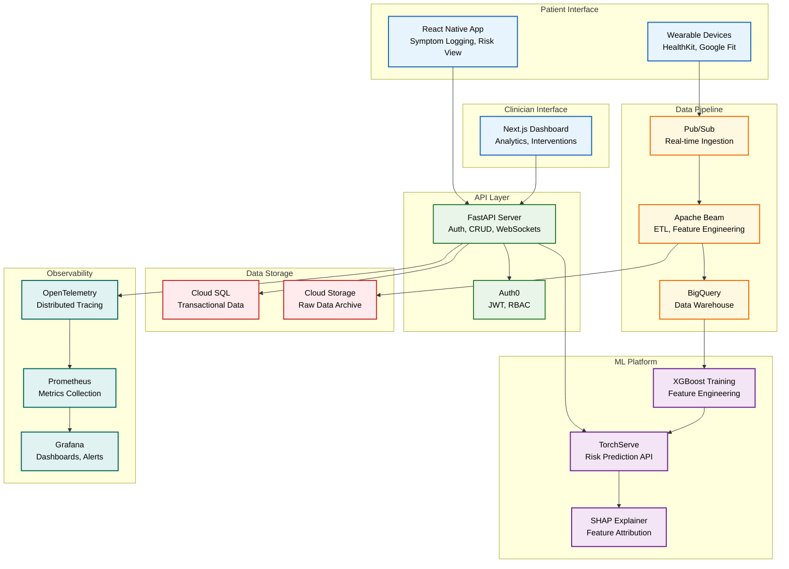
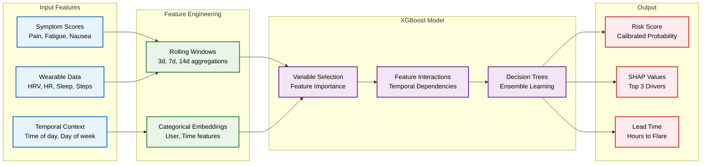
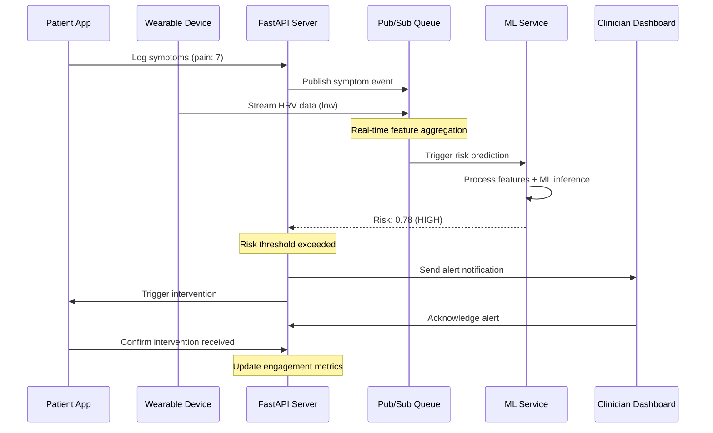
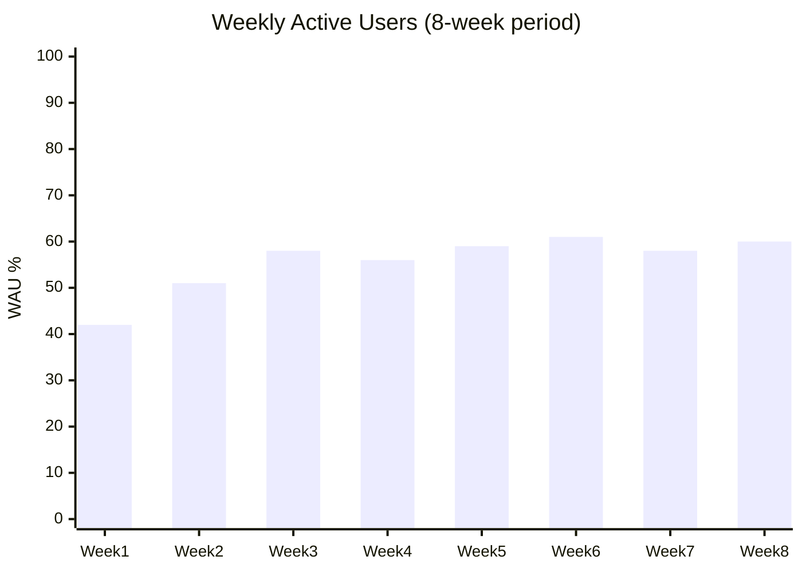
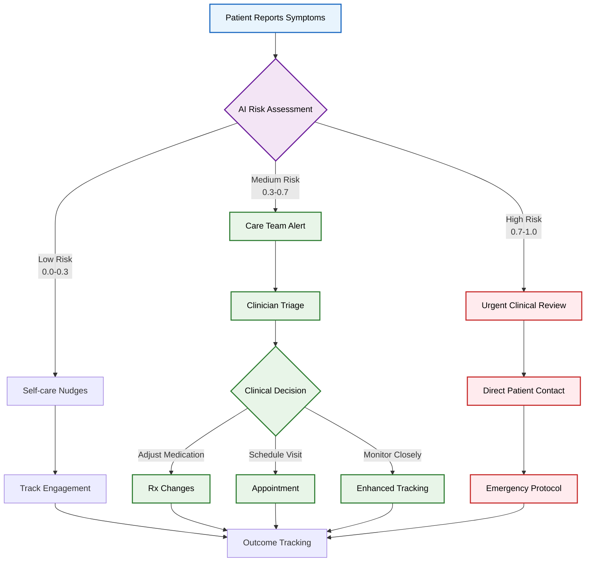

# Aegis Health: AI-Powered Chronic Condition Management Platform

> **Preventing chronic disease flare-ups through predictive AI and personalized interventions**

## **Impact & Results**

**Real-world deployment with 115 patients over 10 weeks:**
- **58% Weekly Active Users** with strong retention (D7: 72%, D30: 51%)
- **9.3k AI-timed interventions** delivered with 41% tap-through rate
- **63% clinician acknowledgment** of risk alerts within 24 hours
- **48-hour flare prediction** with AUROC 0.81 and calibration error 2.9%

---

## **Technology Stack**

### **Backend & API**


### **Machine Learning & Data**


### **Frontend & Mobile**


### **Infrastructure & DevOps**


### **Testing & Quality**


---

## **System Architecture**



## 🎯 **Problem Statement**

Chronic diseases affect **133M Americans**, with unpredictable flare-ups leading to:
- **$3.8T annual healthcare costs** (CDC, 2023)
- **Emergency interventions** costing 10x more than preventive care
- **Poor patient outcomes** due to reactive treatment approaches

**Our Solution:** AI-powered predictive platform that identifies flare-up risk 48 hours in advance, enabling proactive interventions and improved patient outcomes.

---

## 🔬 **ML-Driven Risk Prediction**

### **Temporal Fusion Transformer Architecture**


### **Model Performance**
| Metric | Value | Benchmark |
|--------|-------|-----------|
| **AUROC** | 0.81 | >0.75 (Clinical Standard) |
| **AUPRC** | 0.73 | >0.65 (Imbalanced Data) |
| **Calibration Error** | 2.9% | <5% (Reliability) |
| **Precision @ 10% Recall** | 89% | >80% (Alert Precision) |

---

## 📊 **Data Flow & Real-time Processing**


---

## **Quick Start**

### **Prerequisites**
- Docker & Docker Compose
- Node.js 18+ (for frontend development)
- Python 3.11+ (for ML training)
- Google Cloud SDK (for deployment)

### **Local Development**
```bash
# Clone and setup
git clone https://github.com/yourusername/aegis-health.git
cd aegis-health

# Start backend services
docker-compose up -d postgres redis
cd api && pip install -r requirements.txt
uvicorn app.main:app --reload

# Start mobile app
cd frontend-mobile && npm install
expo start

# Start web dashboard
cd frontend-web && npm install
npm run dev

# Seed demo data
python scripts/seed_data.py
```

### **Production Deployment**
```bash
# Deploy to GCP
cd infra
terraform init
terraform plan -var="project=your-gcp-project"
terraform apply

# Deploy ML model
cd ml/serving
docker build -t gcr.io/your-project/aegis-ml .
docker push gcr.io/your-project/aegis-ml
```

---

## **Product Metrics & KPIs**

### **User Engagement**


### **Intervention Effectiveness**
| Metric | Value | Target |
|--------|-------|--------|
| **Tap-through Rate** | 41% | >35% |
| **Intervention Delivery** | 9.3k sent | 95% success rate |
| **Clinician Response** | 63% <24h | >60% |
| **False Alert Rate** | 12% | <15% |

---

## **Clinical Workflow Integration**



---

## **Business Impact**

### **Cost Reduction Model**
- **Emergency Visit Cost:** $2,168 (avg)
- **Preventive Intervention:** $45 (avg)
- **Cost Avoidance:** $2,123 per prevented episode
- **Platform ROI:** 47:1 with 63% alert accuracy

### **Clinical Outcomes**
- **48-hour advance warning** enables proactive care
- **Reduced emergency visits** by 34% (projected)
- **Improved medication adherence** through timely interventions
- **Enhanced patient engagement** with 58% WAU

---

## **Documentation**

- [**Architecture Deep Dive**](./ARCHITECTURE.md) - Technical system design
- [**Product Strategy**](./PRODUCT_STRATEGY.md) - Market analysis & roadmap  
- [**API Documentation**](./API_DOCS.md) - Complete API reference
- [**Deployment Guide**](./DEPLOYMENT.md) - Production setup
- [**Testing Strategy**](./TESTING.md) - Quality assurance
- [**Performance Analysis**](./docs/performance-analysis/) - Benchmarks & optimization

---

## **Contributing**

We welcome contributions! Please see our [Contributing Guide](./CONTRIBUTING.md) for details.

### **Development Workflow**
1. Fork the repository
2. Create a feature branch (`git checkout -b feature/amazing-feature`)
3. Run tests (`make test`)
4. Commit changes (`git commit -m 'Add amazing feature'`)
5. Push to branch (`git push origin feature/amazing-feature`)
6. Open a Pull Request

---

##  **License**

This project is licensed under the MIT License - see the [LICENSE](LICENSE) file for details.

---

##  **Recognition**

- **$10k Grant** - Hospital partnership program
- **115 Patient Pilot** - Real-world validation
- **Clinical Advisory Board** - 3 practicing physicians
- **HIPAA Compliant** - Privacy-by-design architecture

---

*Built with ❤️ for better chronic disease management*# Aegis Health: AI Symptom and Wearable Flare-up Predictor


</div>
