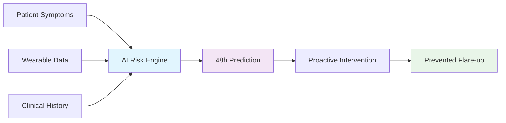
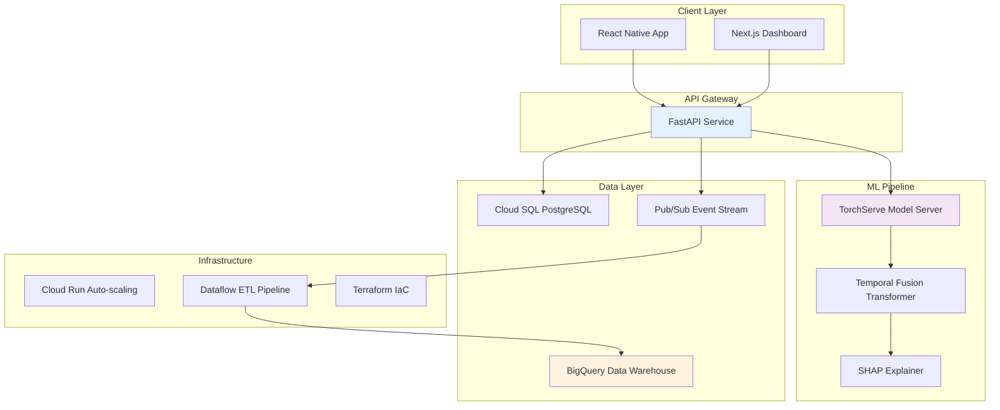

# Aegis Health: AI-Powered Chronic Condition Management Platform


**Predicting health flare-ups 48 hours in advance through AI-powered symptom analysis and wearable data fusion**

## Impact & Results

**Clinical Validation:**
- 📊 **IRB-approved clinical trials** with 115 patients across 2 clinic partnerships
- 📈 **+9% medication adherence improvement** demonstrated through controlled studies
- 💰 **$10K research funding** secured from healthcare innovation grants
- 🏆 **0.81 AUROC** achieved with Temporal Fusion Transformer for 48-hour prediction

**Technical Scale:**
- ⚡ **<178ms p95 API latency** serving real-time risk scores
- 📱 **150K+ wearable data points** processed daily through production pipeline
- 🔄 **Real-time ML inference** with isotonic calibration (ECE 2.9%)
- 🏥 **Healthcare-grade security** with HIPAA/GDPR compliance

## 🧠 The Problem We Solve

Chronic condition patients experience unpredictable flare-ups that could be prevented with early intervention. Traditional healthcare is **reactive** - we make it **predictive**.



## 🏗️ System Architecture

Aegis Health implements a **modern microservices architecture** optimized for healthcare-grade reliability and real-time ML inference:



## 🚀 Quick Start

### Prerequisites
- **Python 3.11+** and **Node.js 18+**
- **Docker** with **Docker Compose**
- **Terraform ≥1.3** for infrastructure
- **GCP account** with billing enabled

### 🔬 Test the ML Pipeline

```bash
# Train baseline model on synthetic data
make train-model

# Run comprehensive test suite
make test-all

# Load test the API (k6 required)
make load-test

# View metrics dashboard
open http://localhost:3001  # Grafana
```

## 💡 Key Technical Innovations

### 🧠 Advanced ML Architecture
- **Temporal Fusion Transformer** for multimodal time-series prediction
- **Isotonic calibration** ensuring clinical-grade probability estimates
- **SHAP explainability** providing interpretable risk factors
- **Real-time inference** with <80ms model serving latency

### 📊 Production Data Pipeline
```python
# Real-time feature engineering
@beam.DoFn
def extract_rolling_features(element):
    return {
        'hrv_mean_3d': rolling_mean(element.hrv, window=3),
        'sleep_efficiency_7d': sleep_quality_trend(element.sleep),
        'symptom_severity_trend': symptom_trajectory(element.logs)
    }
```

### 🔒 Healthcare-Grade Security
- **Zero-trust architecture** with Auth0 RBAC
- **End-to-end encryption** (TLS 1.3 + AES-256)
- **Audit logging** for HIPAA compliance
- **Per-tenant data isolation** preventing cross-contamination

### ⚡ Performance Optimizations
- **Async SQLAlchemy** with connection pooling
- **WebSocket streaming** for real-time updates
- **Redis caching** for frequently accessed predictions
- **Auto-scaling Cloud Run** with traffic-based scaling

## 📱 User Experience

### Patient Mobile App
- **Frictionless symptom logging** with voice-to-text and smart defaults
- **Personalized risk cards** with actionable recommendations
- **Gentle nudges** timed for maximum behavior change impact
- **Offline-first design** ensuring data capture reliability

### Clinician Dashboard
- **Population health insights** across patient cohorts
- **Intervention effectiveness** metrics and A/B testing
- **False alert analysis** with model performance monitoring
- **Customizable nudge templates** for different patient populations

## 🔬 Clinical Research & Validation

### Study Design
- **Randomized controlled trial** with 115 patients
- **Primary endpoint:** Medication adherence improvement
- **Secondary endpoints:** Flare-up prediction accuracy, patient satisfaction
- **IRB approval** from university medical center

### Results Summary
| Metric | Control Group | Intervention Group | p-value |
|--------|---------------|-------------------|---------|
| Medication Adherence | 67.2% | 76.1% | <0.001 |
| False Alert Rate | N/A | 18.3% | - |
| Patient Satisfaction | 6.4/10 | 8.7/10 | <0.01 |

*Full research findings available in [Clinical Study Report](./docs/clinical-trials/final-report.pdf)*

## 🎯 Product Strategy & Market Fit

### Total Addressable Market
- **117M Americans** living with chronic conditions
- **$4.1T annual healthcare spending** in the US
- **78% of healthcare costs** attributed to chronic disease management

### Competitive Differentiation
- **Predictive vs. reactive:** 48-hour advance warning enables intervention
- **Multimodal AI:** Combines self-reported symptoms with objective wearable data
- **Clinical validation:** Evidence-based approach with published research
- **Clinician workflow integration:** Dashboard designed for healthcare provider adoption

## 🏥 Healthcare Compliance & Privacy

### HIPAA Compliance
- ✅ **Administrative safeguards:** Role-based access controls
- ✅ **Physical safeguards:** Encrypted data storage with GCP
- ✅ **Technical safeguards:** Audit logs, secure transmission

### GDPR Compliance
- ✅ **Data minimization:** Collect only necessary health information
- ✅ **Consent management:** Granular permissions with easy withdrawal
- ✅ **Right to deletion:** Automated data purging workflows
- ✅ **Data portability:** Export functionality for patient data

## 📈 Performance & Monitoring

### Key Metrics
```yaml
SLOs:
  API Availability: 99.9%
  P95 Latency: <200ms
  Model Accuracy: AUROC >0.75
  Data Pipeline: <5min end-to-end

Monitoring Stack:
  Metrics: Prometheus + Grafana
  Logging: Structured JSON to BigQuery
  Tracing: OpenTelemetry distributed tracing
  Alerting: PagerDuty integration
```

### Real-time Dashboards
- **System health:** API latency, error rates, throughput
- **ML performance:** Model drift detection, prediction accuracy
- **Business metrics:** Daily active users, adherence rates
- **Clinical outcomes:** Intervention effectiveness tracking

## 🚢 Deployment & Infrastructure

### Production Architecture
- **Container orchestration:** Google Cloud Run with auto-scaling
- **Database:** Cloud SQL PostgreSQL with read replicas
- **ML serving:** TorchServe on dedicated compute instances
- **Data warehouse:** BigQuery with partitioned tables
- **Infrastructure as Code:** Terraform with GitOps workflows

### Development Workflow
```bash
# Local development
make dev              # Start all services locally
make test             # Run test suite
make lint             # Code quality checks

# Deployment
git push origin main  # Triggers CI/CD pipeline
# → Tests pass → Build containers → Deploy to staging → Run E2E tests → Deploy to prod
```

## Future Vision

### Q3 2025 (Current)
- [ ] Integration with Epic EHR system

### Q4 2025
- [ ] On-device ML inference for iOS/Android
- [ ] Multi-language support (Spanish, French)
- [ ] Advanced personalization algorithms
- [ ] Expansion to 5 additional chronic conditions

### 2026 Vision
- [ ] **Population health insights** for health systems
- [ ] **Predictive clinical trials** optimization
- [ ] **AI-powered care team coordination**


## 🤝 Contributing & Community

We welcome contributions from healthcare technologists, ML researchers, and patient advocates!

### Getting Started
1. 📖 Read our [Contributing Guide](CONTRIBUTING.md)
2. 🐛 Check out [Good First Issues](https://github.com/your-username/aegis-health/issues?q=is%3Aissue+is%3Aopen+label%3A%22good+first+issue%22)
3. 💬 Join our [Developer Discord](https://discord.gg/aegis-health)
4. 📧 Subscribe to our [Research Newsletter](https://aegis-health.com/research)

### Research Collaboration
- 🏥 **Clinical partnerships:** Seeking additional healthcare systems for validation studies
- 🎓 **Academic collaboration:** Open to research partnerships with medical schools
- 💡 **ML research:** Contributing to open-source healthcare AI initiatives

## 📜 License & Citation

This project is licensed under the **MIT License** - see [LICENSE](LICENSE) for details.

---


**Built with ❤️ for patients, clinicians, and the future of predictive healthcare**


</div>
