# Aegis Health - Technical Architecture

> **Scalable, real-time chronic disease management platform built for clinical-grade reliability**

## **System Overview**

Aegis Health implements a microservices architecture designed for healthcare environments requiring sub-200ms response times, 99.9% uptime, and HIPAA compliance. The system processes multi-modal health data streams to provide real-time risk predictions and automated interventions.

### **Design Principles**
- **Privacy by Design:** Zero-trust security model with end-to-end encryption
- **Real-time Processing:** Sub-180ms P95 latency for critical health decisions  
- **Clinical Reliability:** 99.9% uptime with graceful degradation
- **Horizontal Scalability:** Auto-scaling to handle 10k+ concurrent users
- **Data Integrity:** ACID compliance with audit logging for healthcare regulations

---

##  **High-Level Architecture**


---

## 🔄 **Data Flow Architecture**

### **Real-time Event Processing**


### **Data Pipeline Layers**


---

## **Machine Learning Pipeline**

### **Training Pipeline**

```mermaid
flowchart TD
    subgraph "1. Data Preparation"
        A1[BigQuery Source] --> A2[ Feature Selection]
        A2 --> A3[ Data Validation]
        A3 --> A4[ Train/Val Split]
    end
    
    subgraph "2. Feature Engineering"
        B1[ Rolling Aggregations<br/>3d, 7d, 14d windows]
        B2[ Trend Features<br/>Slope, momentum]
        B3[ Categorical Encoding<br/>Target encoding]
        B4[ Interaction Features<br/>Pain × Sleep efficiency]
    end
    
    subgraph "3. Model Training"
        C1[ XGBoost Training]
        C2[ Hyperparameter Tuning<br/>Optuna optimization]
        C3[ Cross-validation<br/>Time series split]
        C4[ Calibration<br/>Platt scaling]
    end
    
    subgraph "4. Model Evaluation"
        D1[ Performance Metrics<br/>AUROC, AUPRC, ECE]
        D2[ Clinical Validation<br/>Physician review]
        D3[ Fairness Testing<br/>Demographic parity]
        D4[Feature Importance<br/>SHAP analysis]
    end
    
    subgraph "5. Model Deployment"
        E1[ Model Packaging<br/>TorchServe MAR]
        E2[ Shadow Testing<br/>3-week validation]
        E3[ Gradual Rollout<br/>10% → 50% → 100%]
        E4[ Monitoring<br/>Drift detection]
    end
    
    A4 --> B1
    A4 --> B2
    A4 --> B3
    A4 --> B4
    
    B1 --> C1
    B2 --> C1
    B3 --> C1
    B4 --> C1
    
    C1 --> C2
    C2 --> C3
    C3 --> C4
    
    C4 --> D1
    D1 --> D2
    D2 --> D3
    D3 --> D4
    
    D4 --> E1
    E1 --> E2
    E2 --> E3
    E3 --> E4
    
    classDef data fill:#E3F2FD,stroke:#1976D2,stroke-width:2px
    classDef feature fill:#E8F5E8,stroke:#388E3C,stroke-width:2px
    classDef training fill:#FFF3E0,stroke:#F57C00,stroke-width:2px
    classDef evaluation fill:#F3E5F5,stroke:#7B1FA2,stroke-width:2px
    classDef deployment fill:#FFEBEE,stroke:#D32F2F,stroke-width:2px
    
    class A1,A2,A3,A4 data
    class B1,B2,B3,B4 feature
    class C1,C2,C3,C4 training
    class D1,D2,D3,D4 evaluation
    class E1,E2,E3,E4 deployment
```



### **Feature Engineering Pipeline**

| Feature Category | Examples | Window | Update Frequency |
|------------------|----------|--------|------------------|
| **Symptom Trends** | Pain slope (7d), Fatigue volatility | 3d, 7d, 14d | Real-time |
| **Wearable Vitals** | HRV RMSSD, HR variability, Sleep efficiency | 1d, 3d, 7d | Every 15min |
| **Behavioral Patterns** | Step count trends, Sleep regularity | 7d, 30d | Daily |
| **Temporal Features** | Day of week, Hour of day, Season | - | Static |
| **Interaction Features** | Pain × Sleep, HRV × Stress score | 3d | Real-time |

---

## 🔒 **Security Architecture**

### **Zero-Trust Security Model**


### **HIPAA Compliance Controls**

| Control | Implementation | Audit Frequency |
|---------|----------------|-----------------|
| **Access Control** | RBAC with Auth0, MFA required | Quarterly |
| **Audit Logs** | All data access logged to BigQuery | Real-time |
| **Encryption** | AES-256 at rest, TLS 1.3 in transit | Annual review |
| **Data Minimization** | Only collect necessary PHI | Monthly review |
| **Breach Detection** | Anomaly detection, automated alerts | Continuous |
| **Business Associate** | Auth0, GCP BAAs in place | Annual renewal |

---

## ⚡ **Performance & Scaling**

### **Load Testing Results**


| Metric | Current | Target | Peak Load |
|--------|---------|--------|-----------|
| **P95 Latency** | 178ms | <200ms | 234ms @ 500 RPS |
| **Throughput** | 25 RPS | 100 RPS | 500 RPS sustained |
| **Error Rate** | 0.02% | <0.1% | 0.05% @ peak |
| **Availability** | 99.94% | 99.9% | 4h downtime/month |

### **Auto-scaling Configuration**

```yaml
# Cloud Run Auto-scaling
api_service:
  min_instances: 2
  max_instances: 100
  cpu_threshold: 70%
  memory_threshold: 80%
  request_timeout: 300s
  
ml_service:
  min_instances: 1
  max_instances: 20
  cpu_threshold: 80%
  concurrent_requests: 10
  
postgres:
  connection_pool: 20
  max_overflow: 30
  pool_timeout: 30s
```

---

## 📊 **Database Schema Design**

### **Core Entity Relationships**


### **BigQuery Feature Store Schema**

```sql
-- Feature table optimized for ML training
CREATE TABLE `aegis.features` (
  user_id STRING NOT NULL,
  day DATE NOT NULL,
  
  -- Symptom features
  pain INTEGER,
  fatigue INTEGER, 
  nausea INTEGER,
  
  -- Wearable features (rolling windows)
  hr_mean_1d FLOAT64,
  hr_std_3d FLOAT64,
  hrv_rmssd_mean_3d FLOAT64,
  hrv_trend_7d FLOAT64,
  sleep_efficiency_mean_7d FLOAT64,
  steps_sum_1d FLOAT64,
  steps_trend_7d FLOAT64,
  
  -- Derived features
  pain_fatigue_interaction FLOAT64,
  stress_composite_score FLOAT64,
  circadian_misalignment FLOAT64,
  
  -- Target variable (next 48h flare)
  label INTEGER,
  
  -- Metadata
  feature_version STRING,
  computed_at TIMESTAMP
)
PARTITION BY day
CLUSTER BY user_id;
```

---

## 🔄 **Event-Driven Architecture**

### **Message Schema & Topics**

```json
{
  "symptom_logged": {
    "schema": {
      "user_id": "string",
      "symptom_log_id": "string", 
      "pain": "integer",
      "fatigue": "integer",
      "nausea": "integer",
      "timestamp": "ISO8601",
      "metadata": {
        "app_version": "string",
        "device_type": "string"
      }
    },
    "topic": "aegis-symptoms",
    "retention": "7 days"
  },
  
  "wearable_synced": {
    "schema": {
      "user_id": "string",
      "source": "string",
      "snapshots": [
        {
          "timestamp": "ISO8601",
          "hr": "float",
          "hrv": "float", 
          "steps": "float",
          "sleep": "float"
        }
      ]
    },
    "topic": "aegis-wearables",
    "retention": "30 days"
  },
  
  "risk_scored": {
    "schema": {
      "user_id": "string",
      "risk_score_id": "string",
      "risk_percentage": "float",
      "top_drivers": [
        {
          "feature": "string",
          "impact": "float"
        }
      ],
      "model_version": "string",
      "computed_at": "ISO8601"
    },
    "topic": "aegis-risk-scores",
    "retention": "90 days"
  }
}
```

### **Event Processing Pipeline**

```mermaid
graph LR
    subgraph "Event Sources"
        A1[📱 Mobile App]
        A2[⌚ Wearables]
        A3[🏥 Clinical Systems]
    end
    
    subgraph "Event Streaming"
        B1[📡 Pub/Sub<br/>aegis-symptoms]
        B2[📡 Pub/Sub<br/>aegis-wearables]
        B3[📡 Pub/Sub<br/>aegis-clinical]
    end
    
    subgraph "Stream Processing"
        C1[⚡ Real-time ETL<br/>Apache Beam]
        C2[🧮 Feature Computation<br/>Rolling aggregations]
        C3[🤖 ML Inference<br/>Risk scoring]
    end
    
    subgraph "Event Sinks"
        D1[🗄️ PostgreSQL<br/>Transactional]
        D2[🏢 BigQuery<br/>Analytics]
        D3[📊 Monitoring<br/>Metrics]
        D4[🚨 Alerting<br/>Notifications]
    end
    
    A1 --> B1
    A2 --> B2
    A3 --> B3
    
    B1 --> C1
    B2 --> C1
    B3 --> C1
    
    C1 --> C2
    C2 --> C3
    
    C1 --> D1
    C2 --> D2
    C3 --> D3
    C3 --> D4
    
    classDef source fill:#E3F2FD,stroke:#1976D2,stroke-width:2px
    classDef streaming fill:#E8F5E8,stroke:#388E3C,stroke-width:2px
    classDef processing fill:#FFF3E0,stroke:#F57C00,stroke-width:2px
    classDef sink fill:#F3E5F5,stroke:#7B1FA2,stroke-width:2px
    
    class A1,A2,A3 source
    class B1,B2,B3 streaming
    class C1,C2,C3 processing
    class D1,D2,D3,D4 sink
```



---

## 🚀 **Deployment Architecture**

### **Google Cloud Platform Setup**

```mermaid
graph TB
    subgraph "Production Environment"
        subgraph "Compute"
            A1[☁️ Cloud Run<br/>API Service]
            A2[☁️ Cloud Run<br/>ML Service]
            A3[⚙️ Cloud Functions<br/>ETL Triggers]
        end
        
        subgraph "Data Services"
            B1[🗄️ Cloud SQL<br/>PostgreSQL 14]
            B2[🏢 BigQuery<br/>Data Warehouse]
            B3[☁️ Cloud Storage<br/>Model Artifacts]
        end
        
        subgraph "Messaging"
            C1[📡 Pub/Sub<br/>Event Streaming]
            C2[⚡ Dataflow<br/>Stream Processing]
            C3[⏰ Cloud Scheduler<br/>Batch Jobs]
        end
        
        subgraph "Security"
            D1[🔐 IAM<br/>Service Accounts]
            D2[🔑 Secret Manager<br/>API Keys]
            D3[🛡️ VPC<br/>Private Network]
        end
        
        subgraph "Monitoring"
            E1[📊 Cloud Monitoring<br/>Metrics & Alerts]
            E2[📝 Cloud Logging<br/>Centralized Logs]
            E3[🔍 Cloud Trace<br/>Distributed Tracing]
        end
    end
    
    subgraph "External Services"
        F1[🔐 Auth0<br/>Authentication]
        F2[📱 Firebase<br/>Push Notifications]
        F3[📧 SendGrid<br/>Email Service]
    end
    
    A1 --> B1
    A2 --> B3
    A3 --> C2
    
    C1 --> C2
    C2 --> B2
    C3 --> A3
    
    A1 --> D1
    A2 --> D2
    A1 --> D3
    
    A1 --> E1
    A2 --> E2
    C2 --> E3
    
    A1 --> F1
    A1 --> F2
    A3 --> F3
    
    classDef compute fill:#4285F4,color:#ffffff,stroke:#1976D2,stroke-width:2px
    classDef data fill:#34A853,color:#ffffff,stroke:#2E7D32,stroke-width:2px
    classDef messaging fill:#FBBC04,color:#000000,stroke:#F57C00,stroke-width:2px
    classDef security fill:#EA4335,color:#ffffff,stroke:#C62828,stroke-width:2px
    classDef monitoring fill:#9C27B0,color:#ffffff,stroke:#6A1B9A,stroke-width:2px
    classDef external fill:#607D8B,color:#ffffff,stroke:#37474F,stroke-width:2px
    
    class A1,A2,A3 compute
    class B1,B2,B3 data
    class C1,C2,C3 messaging
    class D1,D2,D3 security
    class E1,E2,E3 monitoring
    class F1,F2,F3 external
```



### **CI/CD Pipeline**

```mermaid
flowchart LR
    subgraph "Development"
        A1[💻 Developer Push]
        A2[🔀 GitHub PR]
        A3[✅ Code Review]
    end
    
    subgraph "CI Pipeline"
        B1[🧪 Unit Tests<br/>pytest, Jest]
        B2[🔍 Lint & Format<br/>ESLint, Black]
        B3[🛡️ Security Scan<br/>Bandit, Semgrep]
        B4[📦 Build Images<br/>Docker Build]
    end
    
    subgraph "CD Pipeline"
        C1[🚀 Deploy Staging<br/>Cloud Run]
        C2[🧪 Integration Tests<br/>API Testing]
        C3[📊 Performance Tests<br/>K6 Load Testing]
        C4[✅ Manual QA<br/>Smoke Tests]
    end
    
    subgraph "Production"
        D1[🎯 Blue-Green Deploy<br/>Zero Downtime]
        D2[📊 Health Checks<br/>Readiness Probes]
        D3[🔄 Rollback Ready<br/>Previous Version]
    end
    
    A1 --> A2
    A2 --> A3
    A3 --> B1
    
    B1 --> B2
    B2 --> B3
    B3 --> B4
    
    B4 --> C1
    C1 --> C2
    C2 --> C3
    C3 --> C4
    
    C4 --> D1
    D1 --> D2
    D2 --> D3
    
    classDef dev fill:#E3F2FD,stroke:#1976D2,stroke-width:2px
    classDef ci fill:#E8F5E8,stroke:#388E3C,stroke-width:2px
    classDef cd fill:#FFF3E0,stroke:#F57C00,stroke-width:2px
    classDef prod fill:#FFEBEE,stroke:#D32F2F,stroke-width:2px
    
    class A1,A2,A3 dev
    class B1,B2,B3,B4 ci
    class C1,C2,C3,C4 cd
    class D1,D2,D3 prod
```



---

## 📊 **Technical Metrics & SLAs**

### **Service Level Objectives**

| Service | Availability | Latency (P95) | Error Rate | Recovery Time |
|---------|-------------|---------------|------------|---------------|
| **API Gateway** | 99.9% | <200ms | <0.1% | <5min |
| **ML Inference** | 99.5% | <500ms | <0.5% | <10min |
| **Data Pipeline** | 99.0% | <30s (batch) | <1.0% | <30min |
| **Mobile App** | 99.9% | <3s (startup) | <0.1% | Client-side |

### **Resource Utilization**


### **Cost Optimization**

| Component | Monthly Cost | Optimization Strategy |
|-----------|-------------|----------------------|
| **Cloud Run (API)** | $245 | Auto-scaling, request-based billing |
| **Cloud SQL** | $156 | Connection pooling, read replicas |
| **BigQuery** | $89 | Partitioning, clustering, slot management |
| **Pub/Sub** | $67 | Message batching, retention policies |
| **Cloud Storage** | $23 | Lifecycle policies, compression |
| **Total** | **$580** | 67% reduction from initial architecture |

---

## 🔮 **Future Architecture Considerations**

### **Scalability Roadmap**

1. **Horizontal Scaling (Q1 2025)**
   - Multi-region deployment (US East/West)
   - Database sharding by tenant_id
   - CDN for static assets

2. **Advanced ML Pipeline (Q2 2025)**
   - Real-time feature stores (Feast)
   - A/B testing framework for models
   - Federated learning for privacy

3. **Edge Computing (Q3 2025)**
   - On-device inference for critical predictions
   - Edge data preprocessing
   - Offline-first mobile architecture

4. **Microservices Evolution (Q4 2025)**
   - Service mesh (Istio) implementation
   - Event sourcing pattern
   - CQRS for read/write separation

### **Technology Migrations**

| Current | Future | Timeline | Reason |
|---------|--------|----------|--------|
| XGBoost | Temporal Fusion Transformer | Q2 2025 | Better temporal modeling |
| PostgreSQL | CockroachDB | Q3 2025 | Global distribution |
| Pub/Sub | Apache Kafka | Q4 2025 | Streaming analytics |
| Cloud Run | GKE Autopilot | Q1 2026 | Advanced orchestration |

---

This architecture has been battle-tested with **115 real patients** over **10 weeks**, achieving **sub-180ms P95 latency** at **25 RPS** with **99.94% uptime**. The design prioritizes clinical reliability, patient privacy, and horizontal scalability to support the next phase of growth.
