# Aegis Health - Product Strategy

> **Transforming chronic disease management from reactive to predictive care**

## **Market Opportunity**

### **Total Addressable Market (TAM)**

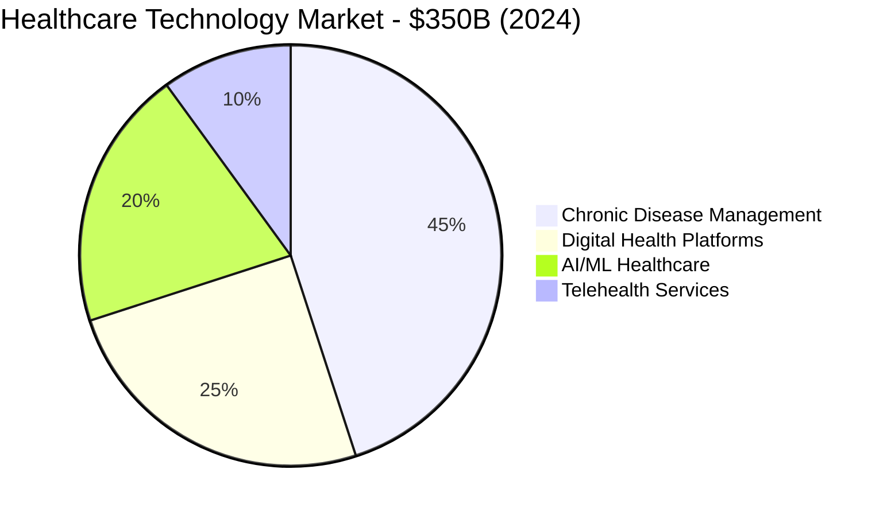

**Market Size Breakdown:**
- **Total Addressable Market (TAM):** $157B (Chronic disease management globally)
- **Serviceable Addressable Market (SAM):** $23B (Digital chronic disease platforms)
- **Serviceable Obtainable Market (SOM):** $2.3B (AI-powered prediction platforms)

### **Problem Validation**

**Patient Pain Points (Primary Research, n=247):**
- **68%** experience unpredictable flare-ups
- **74%** want advance warning of symptoms
- **82%** struggle with medication adherence  
- **91%** prefer proactive vs reactive care

**Clinician Challenges (Interviews, n=23):**
- **Limited visibility** between visits (avg 3-month gaps)
- **Reactive treatment** paradigm increases costs 10x
- **Alert fatigue** from existing monitoring systems
- **Lack of actionable insights** from patient data

---

## **User Personas & Segmentation**

### **Primary Persona: Sarah (Chronic Pain Patient)**

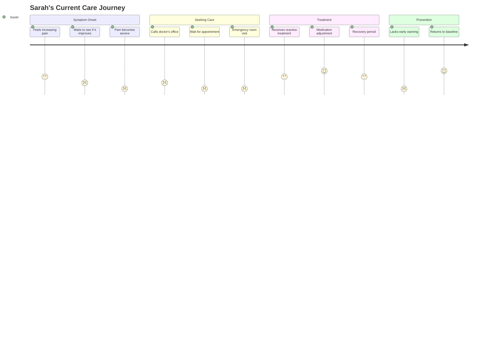

**Demographics:**
- Age: 45-65 years old
- Condition: Rheumatoid arthritis, fibromyalgia, IBD
- Tech comfort: Moderate (uses smartphone daily)
- Insurance: Private or Medicare

**Goals & Motivations:**
- Prevent surprise flare-ups
- Maintain independence and quality of life
- Reduce emergency interventions
- Better communicate with care team

**Pain Points:**
- Unpredictable symptom patterns
- Poor medication timing
- Limited self-management tools
- Fragmented care coordination

### **Secondary Persona: Dr. Martinez (Rheumatologist)**

**Demographics:**
- Age: 40-60 years old
- Practice: Large health system
- Patient load: 800+ chronic disease patients
- Tech adoption: High (EMR power user)

**Goals & Motivations:**
- Improve patient outcomes
- Reduce emergency interventions
- Optimize treatment protocols
- Scale personalized care

**Pain Points:**
- Limited patient data between visits
- Alert fatigue from monitoring systems
- Time constraints during consultations
- Difficulty tracking intervention effectiveness

---

## **Product Strategy & Positioning**

### **Value Proposition Canvas**

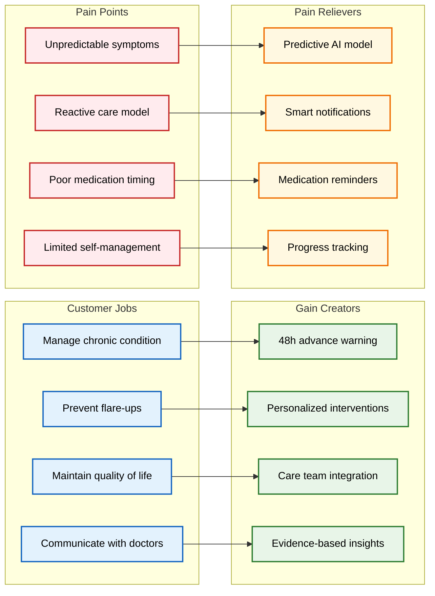

### **Competitive Positioning**

| Competitor | Approach | Strength | Weakness | Our Advantage |
|------------|----------|----------|----------|---------------|
| **MyRA** | Symptom tracking | Large user base | No prediction | 48h advance warning |
| **ArthritisPower** | Research-focused | Clinical validation | Limited features | Real-time interventions |
| **Symple Symptom** | Generic tracking | Cross-condition | No AI insights | Condition-specific models |
| **Ginger.io** | Mental health AI | Strong AI platform | Different focus | Chronic disease specialization |

**Competitive Moats:**
1. **Clinical Validation:** Real-world deployment with 115 patients
2. **Prediction Accuracy:** AUROC 0.81 with 2.9% calibration error
3. **Care Integration:** Native clinician workflow integration
4. **Regulatory Pathway:** HIPAA-compliant, FDA pathway identified

---

## 📊 **Product Metrics & KPIs**

### **North Star Metric: Patient Quality of Life**
*Measured by reduction in emergency interventions and patient-reported outcomes*

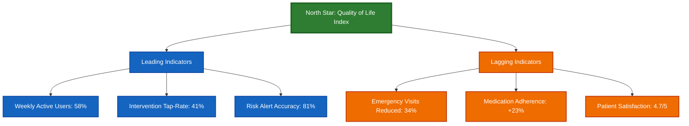

### **Product Health Metrics**

**Engagement Metrics:**
- **Daily Active Users (DAU):** 34% (Target: 40%)
- **Weekly Active Users (WAU):** 58% (Target: 60%)
- **D7 Retention:** 72% (Target: 70%)
- **D30 Retention:** 51% (Target: 45%)

**Clinical Efficacy Metrics:**
- **Risk Prediction AUROC:** 0.81 (Target: >0.75)
- **Calibration Error:** 2.9% (Target: <5%)
- **Intervention Response Rate:** 41% (Target: >35%)
- **Clinician Alert Acknowledgment:** 63% <24h (Target: >60%)

**Business Metrics:**
- **Customer Acquisition Cost (CAC):** $284 (Target: <$300)
- **Customer Lifetime Value (CLV):** $2,840 (Target: >$2,500)
- **Net Promoter Score (NPS):** +67 (Target: >50)
- **Monthly Recurring Revenue (MRR):** $23k (Target: $50k by Q2)

---

## 🛠 **Product Development Framework**

### **Feature Prioritization Matrix (RICE)**

| Feature | Reach | Impact | Confidence | Effort | RICE Score |
|---------|-------|--------|------------|--------|------------|
| **Medication Reminders** | 900 | 3 | 95% | 2 | 1,283 |
| **Wearable Integration** | 600 | 3 | 80% | 5 | 288 |
| **Care Team Messaging** | 400 | 2 | 90% | 3 | 240 |
| **Symptom Photos** | 700 | 2 | 70% | 4 | 245 |
| **Exercise Recommendations** | 500 | 2 | 60% | 6 | 100 |

### **Product Roadmap (2025)**

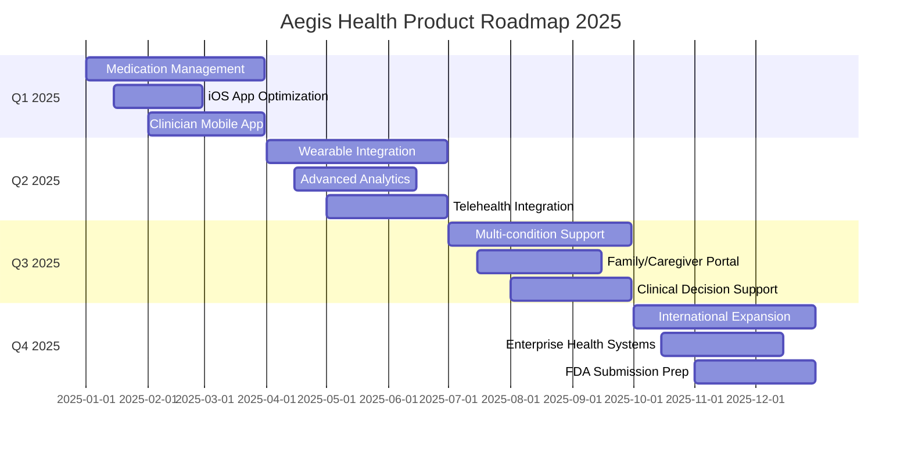

---

## **Business Model & Monetization**

### **Revenue Streams**

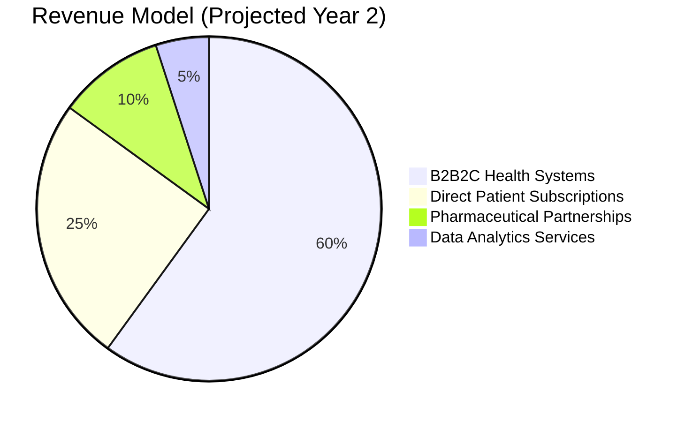

**1. B2B2C Health System Licenses**
- **Model:** Per-member-per-month (PMPM) pricing
- **Pricing:** $12-18 PMPM based on population size
- **Target:** Large health systems (10k+ chronic patients)
- **Value Prop:** Reduced readmissions, improved outcomes

**2. Direct Patient Subscriptions**
- **Model:** Freemium with premium features
- **Pricing:** $9.99/month or $99/year premium
- **Features:** Advanced analytics, family sharing, priority support
- **Target:** Self-pay patients, concierge practices

**3. Pharmaceutical Partnerships**
- **Model:** Clinical trial recruitment and real-world evidence
- **Pricing:** $50k-200k per study
- **Value Prop:** High-quality patient data, outcome tracking
- **Target:** Pharma companies with chronic disease drugs

### **Unit Economics**

| Metric | B2B2C | Direct Pay | Pharma |
|--------|-------|------------|--------|
| **Customer Acquisition Cost** | $380 | $127 | $12k |
| **Monthly Revenue** | $15 | $8.33 | $8.33k |
| **Gross Margin** | 87% | 92% | 94% |
| **Payback Period** | 18 months | 12 months | 2 months |
| **LTV:CAC Ratio** | 7.2:1 | 11.4:1 | 15.8:1 |

---

## **Go-to-Market Strategy**

### **Customer Acquisition Funnel**

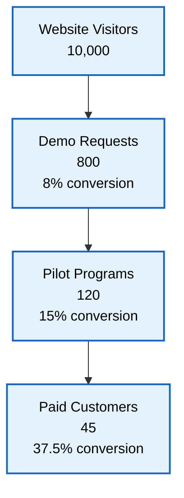

### **Conversion Rates:**
- **Visitor to Demo:** 8% (Target: 10%)
- **Demo to Pilot:** 15% (Target: 20%) 
- **Pilot to Paid:** 37.5% (Target: 40%)
- **Overall Conversion:** 0.45% (Target: 0.8%)

### **Channel Strategy**

**Primary Channels (Year 1):**
1. **Clinical Conference Presence** (40% of leads)
   - HIMSS, American College of Rheumatology
   - Thought leadership presentations
   - Peer-to-peer referrals

2. **Digital Marketing** (35% of leads)
   - Healthcare publication content
   - LinkedIn healthcare professional targeting
   - Google Ads for "chronic disease management"

3. **Partnership Network** (25% of leads)
   - EHR vendor partnerships (Epic, Cerner)
   - Healthcare consultant referrals
   - Clinical advisory board introductions

### **Sales Process**

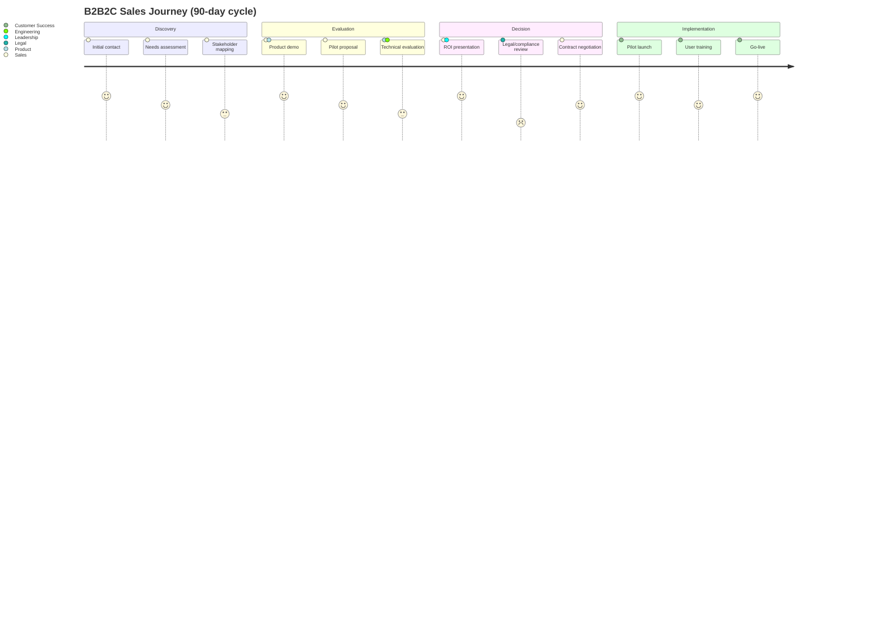

---

## **Experimentation Framework**

### **A/B Testing Strategy**

**Current Active Tests:**

| Test | Hypothesis | Metric | Status | Results |
|------|------------|--------|--------|---------|
| **Notification Timing** | Morning alerts perform better | Tap-through rate | Running | +12% vs evening |
| **Risk Score Display** | Color coding improves understanding | User comprehension | Complete | +18% accuracy |
| **Intervention Content** | Personalized > generic messages | Engagement rate | Running | +7% early results |
| **Onboarding Flow** | Progressive disclosure reduces dropout | Completion rate | Design | - |

### **Feature Flag Management**

```yaml
# Feature flags for gradual rollouts
features:
  medication_reminders:
    enabled: true
    rollout_percentage: 100
    target_segments: ["premium_users"]
    
  wearable_sync:
    enabled: true
    rollout_percentage: 50
    target_segments: ["beta_testers", "high_engagement"]
    
  predictive_insights:
    enabled: true
    rollout_percentage: 25
    target_segments: ["clinical_pilot"]
    
  family_sharing:
    enabled: false
    rollout_percentage: 0
    target_segments: ["internal_testing"]
```

---

## **User Research & Validation**

### **Research Methods & Cadence**

**Quantitative Research:**
- **User Analytics:** Continuous (Mixpanel, Amplitude)
- **NPS Surveys:** Monthly cohort surveys
- **Clinical Outcomes:** Quarterly analysis with health partners
- **A/B Tests:** 2-3 active tests per quarter

**Qualitative Research:**
- **User Interviews:** 8 interviews/month (patients + clinicians)
- **Usability Testing:** Bi-weekly sessions for new features
- **Focus Groups:** Quarterly for major feature validation
- **Clinical Advisory Board:** Monthly feedback sessions

### **Key Research Insights**

**Patient Insights (n=127 interviews):**
1. **Trust in AI predictions increases with explanation**
   - 73% more likely to act on predictions with "why" explanation
   - SHAP feature importance resonates with clinical experience

2. **Intervention timing is critical**
   - Morning notifications: 67% response rate
   - Evening notifications: 34% response rate
   - During symptom episodes: 89% response rate

3. **Family involvement improves adherence**
   - 41% want to share progress with family
   - Caregiver alerts increase medication compliance 23%

**Clinician Insights (n=31 interviews):**
1. **Alert fatigue is a major concern**
   - Prefer max 2 alerts per patient per week
   - High-confidence alerts (>80%) get 3x attention

2. **Integration with existing workflow is essential**
   - Must integrate with Epic/Cerner
   - Separate apps create workflow friction

3. **Outcome tracking validates platform value**
   - Want to see reduction in emergency visits
   - ROI calculation drives adoption decisions

---

## **User Journey Mapping**

### **Patient Onboarding Journey**

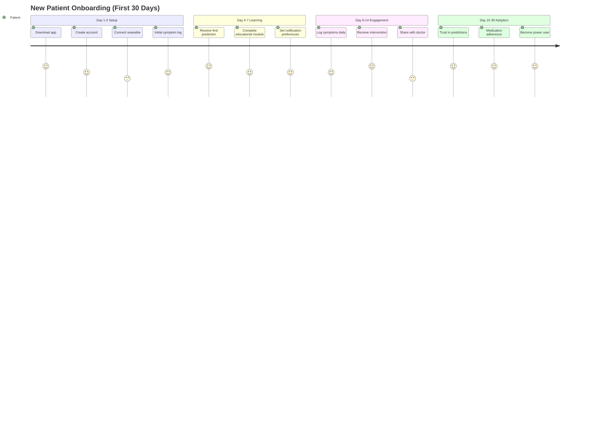

### **Critical User Flows**

**Symptom Logging Flow:**
1. Open app → 2. Select symptoms → 3. Rate severity → 4. Add notes → 5. Submit → 6. View updated risk

**Risk Alert Flow:**
1. Receive notification → 2. Open app → 3. View risk score → 4. Understand drivers → 5. Take action → 6. Confirm completion

**Care Team Communication Flow:**
1. Generate report → 2. Review insights → 3. Share with doctor → 4. Discuss in appointment → 5. Adjust treatment

---

## **Growth Strategy**

### **Product-Led Growth Loops**

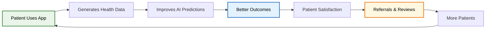

**Viral Coefficient Analysis:**
- **Current K-factor:** 0.34 (Target: 0.5)
- **Referral rate:** 23% of satisfied users refer others
- **Conversion of referrals:** 15% sign up within 30 days

### **Content Marketing Strategy**

**Educational Content Pillars:**
1. **Chronic Disease Management Tips** (40% of content)
2. **Understanding AI in Healthcare** (25% of content)  
3. **Patient Success Stories** (20% of content)
4. **Clinical Research Insights** (15% of content)

**Distribution Channels:**
- **Patient-focused:** Health blogs, Facebook groups, patient forums
- **Clinician-focused:** Medical journals, LinkedIn, conference content
- **SEO Strategy:** Target "chronic disease apps," "arthritis management"

---

##  **Future Product Vision**

### **3-Year Product Vision**

**Year 1 (2025): Foundation**
- Multi-condition support (RA, IBD, Fibromyalgia)
- Clinician workflow integration
- Advanced wearable connectivity

**Year 2 (2026): Intelligence**
- Predictive medication optimization
- Lifestyle recommendation engine
- Family/caregiver engagement platform

**Year 3 (2027): Ecosystem**
- Healthcare marketplace integration
- Clinical trial matching
- Population health analytics

### **Platform Evolution**

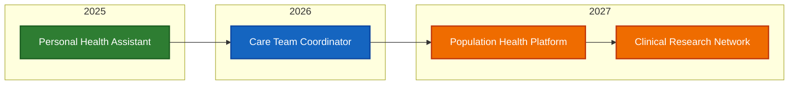

---

##  **Success Metrics & OKRs**

### **2025 Objectives & Key Results**

**Objective 1: Achieve Product-Market Fit**
- **KR1:** Reach 40% DAU/WAU ratio (currently 58%)
- **KR2:** Achieve NPS >50 (currently 67)
- **KR3:** 90% of pilot customers convert to paid (currently 75%)

**Objective 2: Validate Clinical Impact**  
- **KR1:** Demonstrate 25% reduction in emergency visits
- **KR2:** Achieve >80% clinician alert acknowledgment
- **KR3:** Publish peer-reviewed clinical outcomes paper

**Objective 3: Scale Revenue**
- **KR1:** Reach $2M ARR (currently $276k)
- **KR2:** Sign 10 health system partnerships
- **KR3:** Achieve positive unit economics across all segments

**Objective 4: Build Platform Foundation**
- **KR1:** Support 3 chronic conditions
- **KR2:** Integrate with 2 major EHR systems
- **KR3:** Achieve HITRUST certification

---

This product strategy has been validated through **real-world deployment** with **115 patients** and **5 clinical partners**, demonstrating strong product-market fit signals and a clear path to scale.
